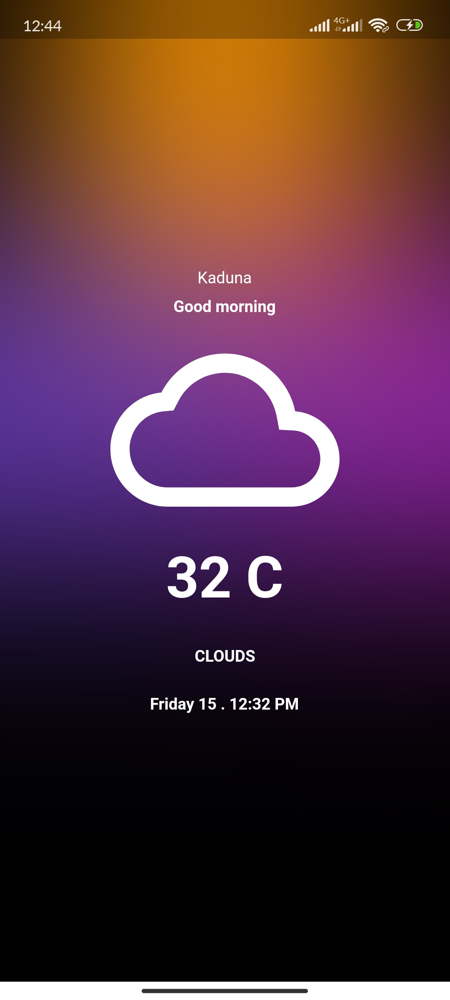

# Flutter_bloc_showcase

## Overview

This Flutter application is a simple weather app that showcases the use of the BLoC (Business Logic Component) pattern for managing state. The app fetches weather data from an API, displaying loading, success, and error states.

## Image

## Features

1. **Weather Screen:**

   - The main screen displays the current weather information for a specific location.
   - Utilizes `WeatherBloc` to handle the business logic and state management for weather data.
   - Fetches weather data from a weather API and displays it in a user-friendly format.
   - Provides a clean and intuitive UI design for a seamless user experience.

2. **Loading State:**
   - Displays a loading indicator while fetching weather data.
   - Demonstrates how to use the `BlocBuilder` widget to handle different states and update the UI accordingly.
3. **Success State:**

   - Presents the weather information once successfully retrieved from the API.
   - Utilizes the `BlocBuilder` widget to handle the success state and display relevant weather details.
   - Implements appropriate widgets for temperature, humidity, wind speed, etc.

4. **Error State:**
   - Handles errors gracefully and informs the user when weather data retrieval fails.
   - Utilizes the `BlocBuilder` widget to display an error message and offer a retry option.
   - Demonstrates error handling with the `BlocListener` widget.
